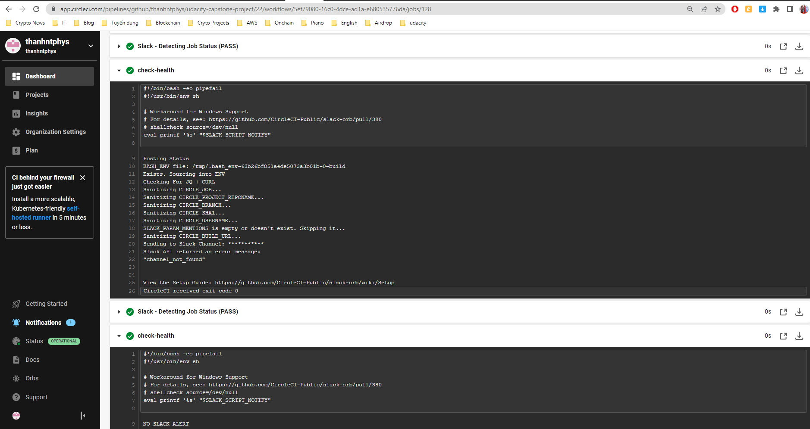

# Udacity Cloud DevOps Engineer: Project 05 - Capstone

In this project we'll apply the skills and knowledge that I've learn from the nanodegree, including:

- Working with AWS
- Using CircleCI to implement CI/CD
- Building pipelines
- Building and push image to ECR
- Building Kubernetes clusters
- Building Docker containers in pipelines

## Application

This is a simple "Hello, World!" site 

## Steps & Screenshots

1. Creating config file for CircleCI

The pipeline:

2. Deploy our app

- Setup the EKS cluster: I've used `ekscli` to setup the cluster automatically through the pipeline
- Linting the Dockerfile

I've done for both failed and succeed cases, as shown in the screenshots below

Lint failed:

Lint succeed:

- Build and push the image to ERC

- Create and deploy k8s resources

I've created `k8s.yml` file, which contains all the resources needed for the project.

Deployment result:

EC2 nodes:

ECR image:

3. Check to see if the app is up and live

I've access the app through both the LoadBalancer DNS.

## How to access to the app

- Through LoadBalancerDNS: [http://a99f59eb8a2194a17b4b0ffdad3061f4-1509147400.us-east-1.elb.amazonaws.com/](http://a99f59eb8a2194a17b4b0ffdad3061f4-1509147400.us-east-1.elb.amazonaws.com/)

## Repo:
- Repo : [https://github.com/thanhntphys/udacity-capstone-project](https://github.com/thanhntphys/udacity-capstone-project)

## Final words

Thank you so much, Udacity!